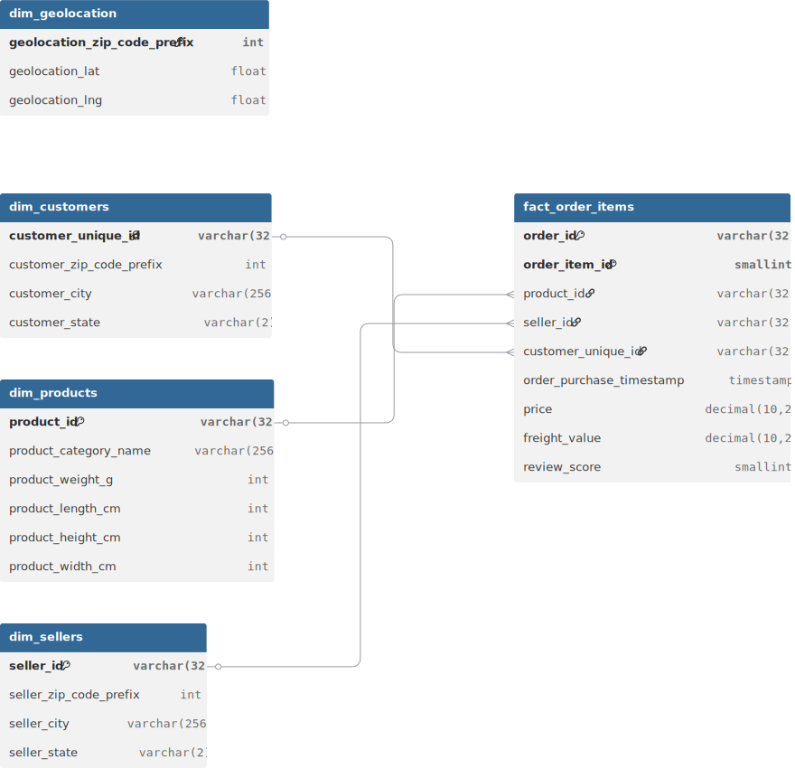
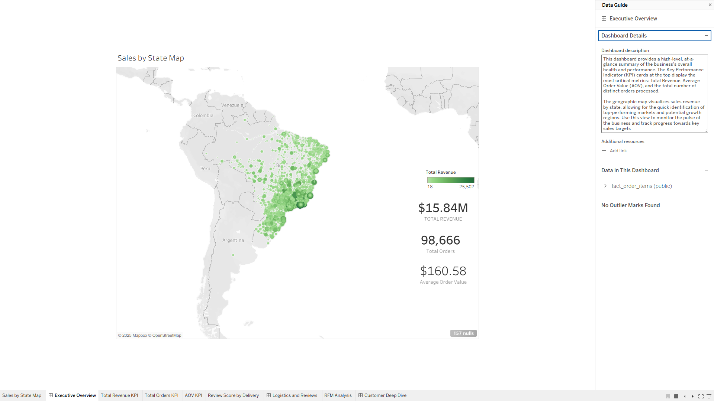
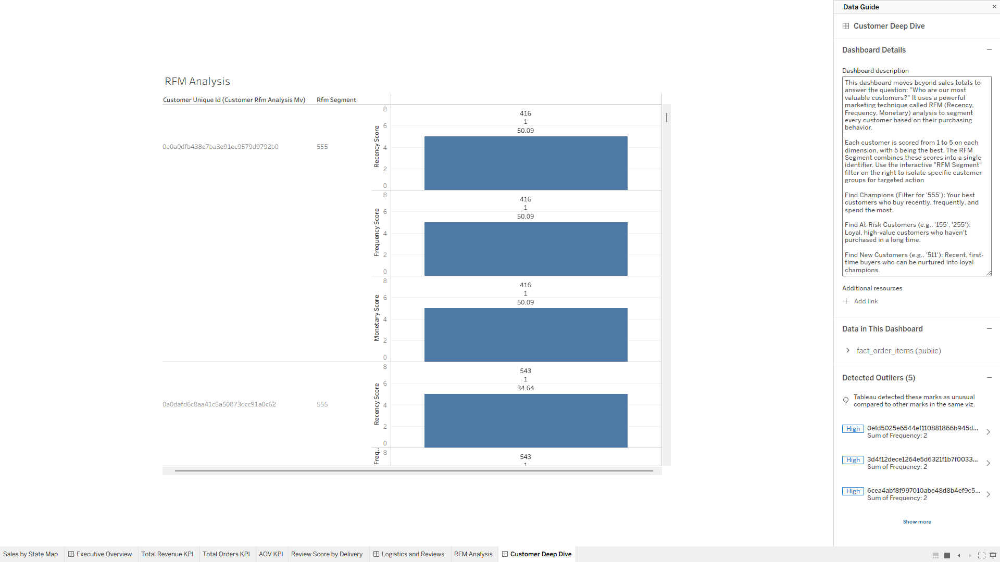
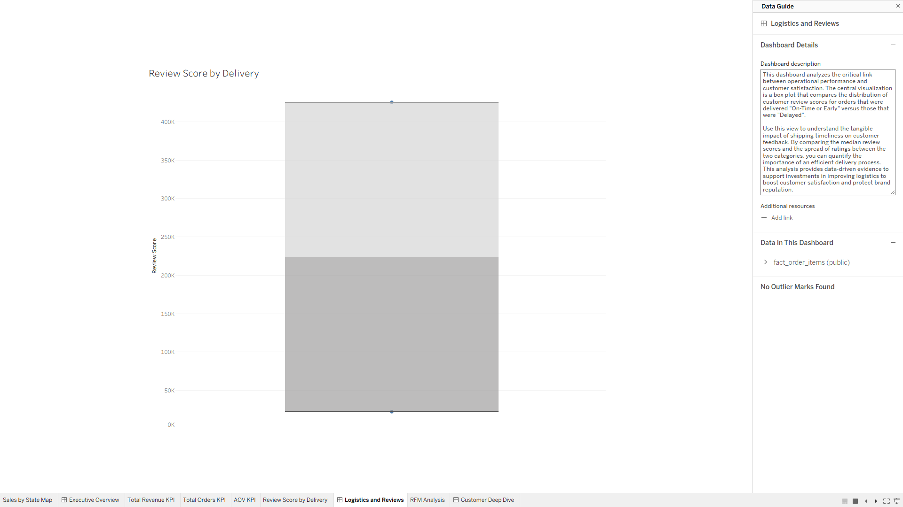

# Driving E-Commerce Profitability: A Strategic Analysis of Seller Performance and Customer Value

## 1. Project Objective
This project delivers a comprehensive Business Intelligence solution designed to empower 
third-party sellers on a large e-commerce platform. The primary goal is to provide sellers with 
a powerful analytics dashboard that enables them to understand sales performance,
identify high-value customer segments, and make data-driven advertising and operational decisions.
This project simulates a real-world task for a Business Intelligence Engineer, demonstrating an 
end-to-end data workflow from raw data ingestion to actionable insights.

## 2. The Business Problem
Third-party sellers often operate with limited visibility into their own performance data, 
making it difficult to answer critical business questions. They struggle to analyze performance 
across key dimensions like product category, customer geography, and logistics efficiency.
This project addresses that gap by building a full-stack BI solution using the public Olist 
Brazilian E-commerce dataset, which contains over 100,000 real-world orders.

**The final dashboard provides clear answers to crucial business questions, including:**

**What are the overall key performance indicators (KPIs) like Total Revenue, Average Order Value (AOV),
and Total Orders?**

**Which geographic regions (states) are driving the most sales and present growth opportunities?**

**Who are our most valuable customers? (Using RFM Segmentation)**

**How does delivery performance (on-time vs. delayed) impact customer satisfaction scores?**

## 3.Technology Stack

* **Data Extraction & Transformation (ETL): Python, Pandas**
* **Data Warehousing: Amazon Redshift (or PostgreSQL)**
* **Database Connectivity: SQLAlchemy, psycopg2**
* **Data Modeling: Star Schema (Fact & Dimension Tables)**
* **Data Analysis: Advanced SQL**
* **Data Visualization: Tableau**

## 4. Data Model: Redshift Star Schema
To optimize for fast and efficient analytical queries, the data is modeled into a star schema. 
This industry-standard design features a central fact table (fact_order_items) containing 
quantitative business metrics, surrounded by descriptive dimension tables 
(dim_customers, dim_products, etc.). This structure minimizes complex joins and significantly
improves query performance for BI tools.

## 5. Dashboard Preview
The final deliverable is a multi-tab interactive dashboard built in Tableau, designed to function as a "Seller Central" analytics portal.

(Insert a screenshot of your final Tableau dashboard here)

**Dashboard Tabs:**

**Executive Overview: High-level KPIs and a geographic sales map for at-a-glance performance monitoring.**

**Customer Deep Dive: Detailed Recency, Frequency, and Monetary (RFM) analysis to identify and segment high-value customers.**

**Logistics & Reviews: A statistical analysis correlating delivery timeliness with customer review scores to uncover operational improvement opportunities.**

